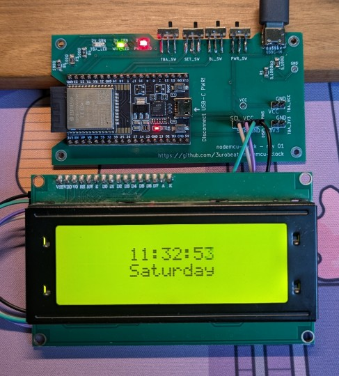
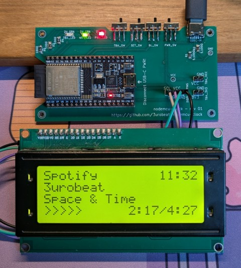

    <h1>nodemcu-clock</h1>
    <h4>Multifunctional desk internet clock, powered by an ESP8266/32 and a LCD display!</h4>
    

        <a href="#introduction">Introduction</a> •
        <a href="#pages">Pages</a> •
        <a href="#hardware">Hardware</a> •
        <a href="#setup">Setup</a>
    

     
    

        
        
         
        What it looks like: Clock page (left), Spotify page (right). Enclosure to be added.
        <!-- Neat, but two logos at once look a little pushy, enable should logo in introduction move further down -->
        <!-- <h1>
            Sponsored by
            
        </h1> -->
    

## Introduction
This is a multifunctional "smart" internet desk clock, powered by a low power microcontroller and a 4x20 LCD display.  
It not only shows the time but also displays various information, such as local weather, current news, and your Spotify playback!  

The device has become an essential part of my desk in the last few years and is an actual useful source of information.  
Seriously!

> [!TIP]
> Want to get your own proper circuit board just like in the pictures above?  
> Read the [PCB manual](./pcb/nodemcu-clock/README.md) to order your own in just a few minutes at  
> 
> ¸                        
> Thank you PCBWay for sponsoring the circuit board creation phase of this project! 🚀

&nbsp;

## Pages
The device cycles between a collection of configurable animated pages, which is explained below.  
Below listed are the pages that are included by default. If you like, you can add your own to the [pages/](src/pages/) directory (and submit it as a [Pull Request](https://github.com/3urobeat/nodemcu-clock/pulls)!).

| **Name** | **About** | **Demo** |
| -------- | --------- | ----------- |
| Clock    | Displays current time, date and weekday. Automatically geolocates your timezone. Uses NTP for syncing time and ip-api for geolocating. |  |
| Weather  | Displays city name, current weather, temp, sunrise and sunset time. Automatically geolocates your coords and city but can be overwritten in config. Uses openweathermap.org (API key required!). |  |
| News     | Displays 4 current headlines from different news outlets, switching to the next one on page reset. Page switch on event (headline finished scrolling through) or after time supported. Uses newsapi.org (API key required!). |  |
| Dino     | Displays a little dino game animation :) |  |
| Spotify  | Displays your current Spotify playback title, artist and progress. |  |

&nbsp;

## Hardware
- ESP8266 or ESP32 (preferred, [DigiKey](https://www.digikey.de/en/products/detail/espressif-systems/ESP32-DEVKITC-32E/12091810))
- LCD Display 4 rows x 20 columns ([Amazon](https://www.amazon.com/s?k=lcd+display+2004))  
  They are available in Green & Blue. You need one with the 4pin 'Serial Adapter', preferably pre-soldered
- Optional switches and status LEDs are described in the [PCB manual](./pcb/nodemcu-clock/README.md)

&nbsp;

### Display Connection Pins
Connect the VCC/5V and GND (Ground) pins of the display to the respective pins on your microcontroller.  
They usually have the same name.

**ESP8266:**
- SDA: D2  
- SCL: D1  
- setupMode switch: D0 -> GND  
- display backlight toggle: D3 -> GND
- WiFi status led: n/a

**ESP32:**
- SDA: 21  
- SCL: 22  
- setupMode switch: 19 -> GND  
- display backlight toggle: 18 -> GND
- WiFi status led (3.3V): 32

&nbsp;

## Setup

### Compiling and flashing firmware
> [!WARNING]
> Are you using the manufactured PCB? **DISCONNECT** the main USB-C power input source **BEFORE** connecting the microcontroller to your PC!

Currently done using the VSCode/VSCodium extension [PlatformIO](https://platformio.org/): 
- [Download](https://github.com/3urobeat/nodemcu-clock/archive/refs/heads/main.zip) this project and extract it
- Open the folder using VSCode/VSCodium with the PlatformIO extension installed
- Connect your board to your PC
  - Linux works out of the box, if Windows requires a driver (CH340?), please refer to the manufacturer's instructions
- Select your board at 'env:' in the bottom panel. If you are using the official PCB, select `esp32-wroom`.
- Click the '->' arrow in the bottom panel to compile & upload (flash) the firmware. You might have to hold the 'BOOT'/'FLASH' button on your board
  - Port not found? Open the [configuration file](./platformio.ini) and adjust `upload_port` at the top, then retry  
    Linux uses `/dev/ttyUSBn` syntax, Windows (I think) the `COMn` syntax, where n is the port number

An easier, non developer method is to be added.

**PCB user?** Make sure to **disconnect** the microcontroller **before** re-attaching the main USB-C power source again.

&nbsp;

### Configuration & Setup Mode
The firmware contains a separate setup mode, which can be toggled by bridging the setup pins listed above (for example with a switch) and then re-powering the board.  
The setup mode spawns a WiFi network, allowing you to connect and configure the device using the web browser of another device, like your mobile phone.

Another way is to edit the [config.cpp](./config/config.cpp) file and then compile & flash the firmware again.  
Both methods are explained here:

    
<b>Setup Mode (click to expand)</b>

    - Bridge the setupMode pins listed above (for example with a switch which you can easily toggle)  
    - Connect power to the board or reset it  
    - The board should power up and display "Entering Setup" instead of "Connecting"  
    - Follow the instructions on the screen:  
        - Open the WiFi settings on your phone and find the "nodemcu-clock setup wifi"  
        - Connect to it with the password "setuppassword136"  
        - Open your browser and open the webpage "192.168.1.1"  
        - When done making changes, click "Save" at the bottom  
        - Unbridge the setupMode pins again and reset the device  
    
    See the FAQ to learn what needs to be configured.

    
<b>Compile-time Config (click to expand)</b>

    - Open the `config/config.cpp` file in a text editor  
    - When done making changes, save the file, recompile the firmware and flash it onto the device.  
      See [Compiling and flashing firmware](https://github.com/3urobeat/nodemcu-clock/#compiling-and-flashing-firmware) for more information.

    Note:  
    Changes made here will only be applied if no settings have already been saved onto the  
    device by a previous start with compile-time config or by using the setup mode.  
    To circumvent this you can uncomment the `CLOCK_IGNOREFS` build flag in `platformio.ini`.  
    Recompile and flash the firmware again.  
    The internal storage will now be ignored and only the compile-time config will be used.

&nbsp;

## FAQ

**What needs to be configured?**  
- You always need to have at least one wifi network configured.  
- Depending on which pages you use, you need to have the required API keys configured (see [Pages](https://github.com/3urobeat/nodemcu-clock/#pages) for more information)

Everything else can be left at default.

**How do I get the API keys?**  
TBA

**The clock won't connect to my iPhone hotpot!**  
Open the settings app and leave the "Personal Hotspot" page open while the clock attempts to connect to available WiFi networks.  
This ensures that the WiFi network is visible.
