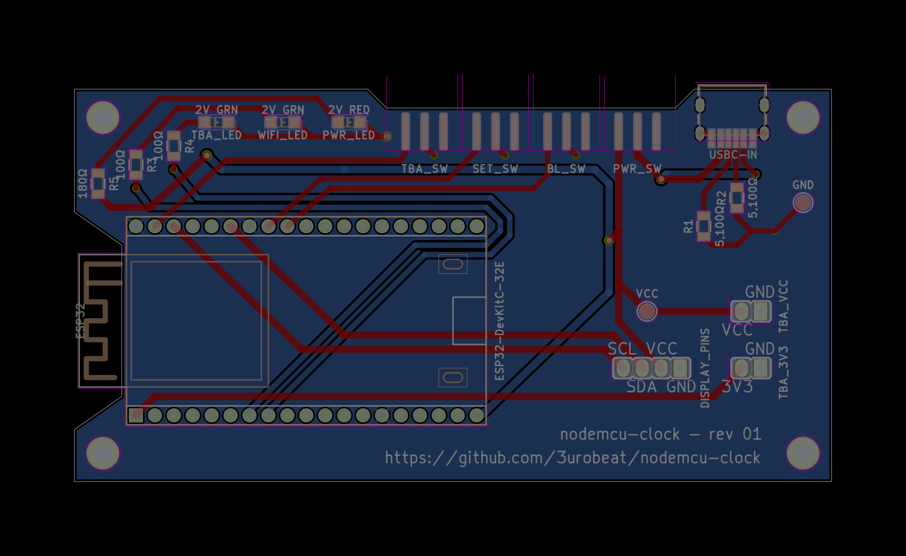
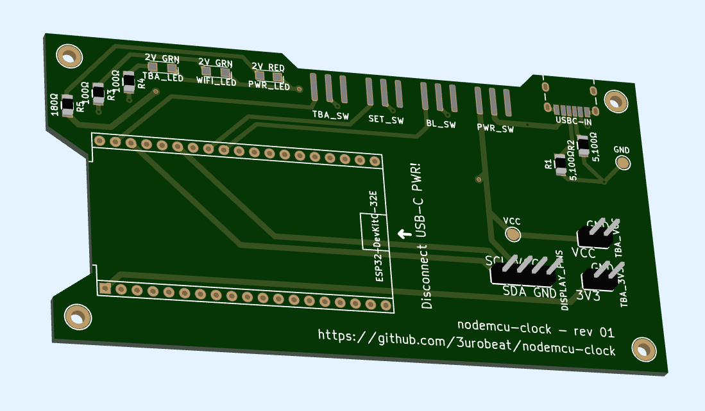

# nodemcu-clock
Schematics for the nodemcu-clock **P**rinted**C**ircuit**B**oard.  
This is a [LibrePCB](https://librepcb.org) project!

## Description
TBA

## Parts used
| Designator | Part | Amount | Link (Germany) |
| ---------- | ---- | ------ | -------------- |
| ESP32 | ESP32-WROOM-32E DevKitC | 1x | [Reichelt](https://www.reichelt.de/de/de/shop/produkt/entwicklungsboard_esp32-wroom-32e-341303) |
| x | HD44780 2004 LCD Green 4x20 with I2C Board | 1x | [Amazon](https://www.amazon.de/dp/B07N8CGM9G) |
| DISPLAY_PINS | Pin Header 2.54mm 1x04 ⌀0.9mm | 1x | [Reichelt](https://www.reichelt.de/de/de/shop/produkt/stiftleiste_1_x_4_polig_gerade_rastermass_2_54_mm-404280) |
| x | Generic (Jumper) Wires DISPLAY_PINS -> LCD | 4x | TODO |
| TBA_VCC, TBA_3V3 | Pin Header 2.54mm 1x02 ⌀0.9mm | 2x | [Reichelt](https://www.reichelt.de/de/de/shop/produkt/stiftleiste_1_x_2_polig_gerade_rastermass_2_54_mm-404273) |
| USBC-IN | USB-C (Power) Port | 1x | [Reichelt](https://www.reichelt.de/de/de/shop/produkt/usb_-_buchse_typ_c_-_horizontal-207595) **NOTE:** This part has data pins but the PCB does not expect them. Alternative TODO |
| PWR_SW, BL_SW, SET_SW, TBA_SW | Generic Slide Switches, 50V 0.5A, 2 Positions, 3 Pins | 4x | [Amazon](https://www.amazon.de/dp/B08VDX231L) |
| PWR_LED | LED, SMD 3216 (1206), <2.3V <25mA, Red | 1x | [Reichelt](https://www.reichelt.de/de/de/shop/produkt/led_smd_3216_1206_rot_140_mcd_130_-156249) |
| WIFI_LED, TBA_LED | LED, SMD 3216 (1206), <2.3V <25mA, Green | 2x | [Reichelt](https://www.reichelt.de/de/de/shop/produkt/led_smd_3216_1206_gruen_90_mcd_140_-156247) |
| R1, R2 | 5100Ω Resistors | 2x | [Reichelt](https://www.reichelt.de/de/de/shop/produkt/smd-widerstand_1206_5_1_kohm_250_mw_5_-18341) |
| R3, R4 | 100Ω Resistors | 2x | [Reichelt](https://www.reichelt.de/de/de/shop/produkt/smd-widerstand_1206_100_ohm_250_mw_5_-18242) |
| R5 | 180Ω Resistor | 1x | [Reichelt](https://www.reichelt.de/de/de/shop/produkt/smd-widerstand_1206_180_ohm_250_mw_5_-18267) |

> [!NOTE]
> TBA_\* (To Be Added) designators describe parts currently without functionality. They have been included to be able to extend the device's functionality in a future firmware update without having to re-manufacture PCBs.

> [!TIP]
> Order some spares! A part can always break during soldering.

## License
This project is licensed under the GPL-3.0 license.

This program is free software: you can redistribute it and/or modify it under the terms of the GNU General Public License as published by the Free Software Foundation, either version 3 of the License, or (at your option) any later version.  
This program is distributed in the hope that it will be useful, but WITHOUT ANY WARRANTY; without even the implied warranty of MERCHANTABILITY or FITNESS FOR A PARTICULAR PURPOSE. See the GNU General Public License for more details.  
You should have received a copy of the GNU General Public License along with this program. If not, see <https://www.gnu.org/licenses/>.
