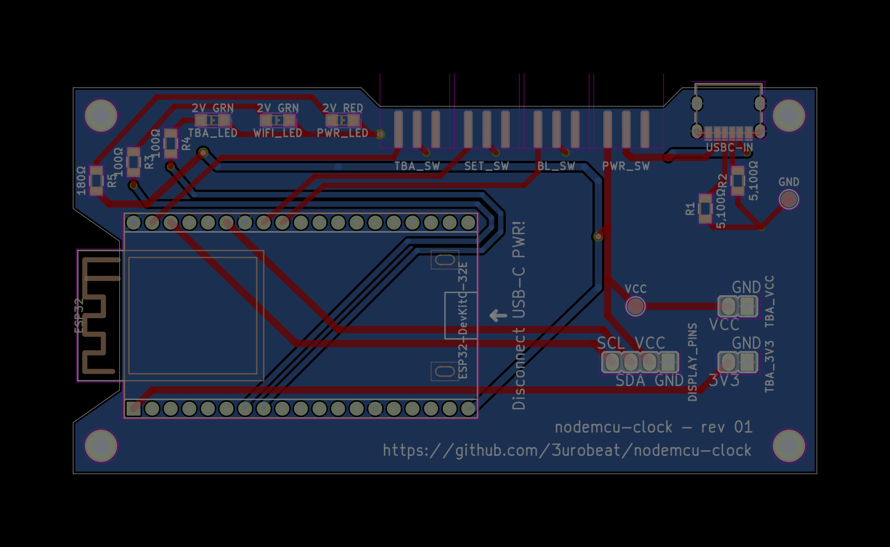

# nodemcu-clock PCB
Schematics for the nodemcu-clock **P**rinted**C**ircuit**B**oard.  
This is a [LibrePCB](https://librepcb.org) project!

    
    

&nbsp;

## Manufacturing
To get your own PCB, download the schematics from the [latest release](https://github.com/3urobeat/nodemcu-clock/releases) and order a "PCB prototype" from a manufacturer of your choice, for example:  

  

I have had a good experience with PCBWay, who have also generously sponsored the circuit board creation phase of this project!*  
Ordering on their page is really straight forward: 
- Visit the [order page](https://www.pcbway.com/QuickOrderOnline.aspx)
- Upload the schematics zip file from the [latest release](https://github.com/3urobeat/nodemcu-clock/releases) at 'Add Gerber File'
- The values below are auto filled - just proceed to checkout! That's it!

Please wait *just* a moment longer though and read this page entirely first.

After a few days, this is what you'll receive in the mail and what it looks like assembled (with amateur soldering skills, ymmv):

    
     
    * While PCBWay has sponsored the manufacturing of this PCB, this is my own, honest opinion, that was not influenced by them.

 

Continue reading below to get the required components to assemble your PCB!

&nbsp;

## Assembling
These are the parts I have used to design the PCB and get mine up and running.  
Depending on where you are in the world you might have to choose different suppliers.  
DigiKey & Amazon deliver pretty much world wide, I'm unsure about Reichelt.  

If your supplier has matching parts but from different manufacturers, make sure they have the same footprint & specifications or adjust the schematics accordingly!  
If your LEDs are not rated at ~2V ~20mA, you require different R3, R4 & R5 resistors!

&nbsp;

| Designator | Part | Amount | Link (Germany) |
| ---------- | ---- | ------ | -------------- |
| ESP32 | ESP32-WROOM-32E DevKitC | 1x | [Reichelt](https://www.reichelt.de/de/de/shop/produkt/entwicklungsboard_esp32-wroom-32e-341303), [DigiKey](https://www.digikey.de/de/products/detail/espressif-systems/ESP32-DEVKITC-32E/12091810) |
| n/a | HD44780 2004 LCD Green 4x20 with I2C Board | 1x | [Amazon](https://www.amazon.de/dp/B07N8CGM9G) |
| DISPLAY_PINS | Pin Header 2.54mm 1x04 ⌀0.9mm | 1x | [Reichelt](https://www.reichelt.de/de/de/shop/produkt/stiftleiste_1_x_4_polig_gerade_rastermass_2_54_mm-404280), [DigiKey](https://www.digikey.de/de/products/detail/w%C3%BCrth-elektronik/61300411121/4846827) |
| n/a | Generic (Jumper) Wires DISPLAY_PINS -> LCD | 4x | TODO |
| TBA_VCC, TBA_3V3 | Pin Header 2.54mm 1x02 ⌀0.9mm | 2x | [Reichelt](https://www.reichelt.de/de/de/shop/produkt/stiftleiste_1_x_2_polig_gerade_rastermass_2_54_mm-404273), [DigiKey](https://www.digikey.de/de/products/detail/w%C3%BCrth-elektronik/61300211121/4846823) |
| USBC-IN | USB-C power only connector | 1x | [DigiKey](https://www.digikey.de/de/products/detail/same-sky-formerly-cui-devices/UJC-HP-3-SMT-TR/12173295) |
| PWR_SW, BL_SW, SET_SW, TBA_SW | Generic Slide Switches, 50V 0.5A, 2 Positions, 3 Pins | 4x | [Amazon](https://www.amazon.de/dp/B08VDX231L) |
| PWR_LED | LED, SMD 3216 (1206), <2.3V <25mA, Red | 1x | [Reichelt](https://www.reichelt.de/de/de/shop/produkt/led_smd_3216_1206_rot_140_mcd_130_-156249) |
| WIFI_LED, TBA_LED | LED, SMD 3216 (1206), <2.3V <25mA, Green | 2x | [Reichelt](https://www.reichelt.de/de/de/shop/produkt/led_smd_3216_1206_gruen_90_mcd_140_-156247) |
| R1, R2 | 5100Ω Resistors | 2x | [Reichelt](https://www.reichelt.de/de/de/shop/produkt/smd-widerstand_1206_5_1_kohm_250_mw_5_-18341), [DigiKey](https://www.digikey.de/de/products/detail/yageo/RC1206JR-075K1L/729305) |
| R3, R4 | 100Ω Resistors | 2x | [Reichelt](https://www.reichelt.de/de/de/shop/produkt/smd-widerstand_1206_100_ohm_250_mw_5_-18242), [DigiKey](https://www.digikey.de/de/products/detail/yageo/RC1206JR-07100RL/729206) |
| R5 | 180Ω Resistor | 1x | [Reichelt](https://www.reichelt.de/de/de/shop/produkt/smd-widerstand_1206_180_ohm_250_mw_5_-18267), [DigiKey](https://www.digikey.de/de/products/detail/yageo/RC1206JR-07180RL/729231) |

> [!NOTE]
> TBA_\* (To Be Added) designators describe parts currently without functionality. They have been included to be able to extend the device's functionality in a future firmware update without having to re-manufacture PCBs.

> [!TIP]
> Order some spares! A part can always break during soldering.

&nbsp;

Assembling the board is relatively straight forward:
- Solder all pins of all components that are connected in the [board render](./nodemcu-clock_Board.png) (first screenshot on this page)
  - Really make sure the switches and USB-C connector are *properly* soldered down. They *will* otherwise rip off at some point.
- ESP32 orientation is marked on the board
- Resistors and these switches have no orientation
- LEDs have a orientation, their cathode goes to ground (right pad in board render). It is usually marked on the component, refer to the datasheet of your LED. You can also often test the orientation using the diode test mode of your multimeter.
- **Before** powering the board up for the first time, check whether all connections shown in the board render are properly established using a multimeter in resistance mode. A short may fry the entire board and all components on it!
- Always make sure that **only one** power source is connected at the same time - either the main USB-C power input or the microcontroller.

#### Continue reading [here](../../README.md) to flash & configure your new board with the nodemcu-clock firmware!

&nbsp;

## License
This project is licensed under the GPL-3.0 license.

This program is free software: you can redistribute it and/or modify it under the terms of the GNU General Public License as published by the Free Software Foundation, either version 3 of the License, or (at your option) any later version.  
This program is distributed in the hope that it will be useful, but WITHOUT ANY WARRANTY; without even the implied warranty of MERCHANTABILITY or FITNESS FOR A PARTICULAR PURPOSE. See the GNU General Public License for more details.  
You should have received a copy of the GNU General Public License along with this program. If not, see <https://www.gnu.org/licenses/>.
